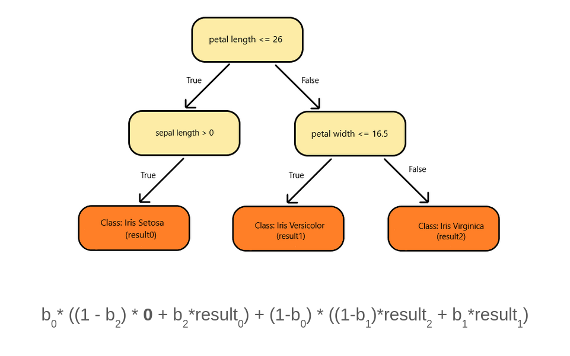

# Homomorphic Tree Evaluator
The aim of this project is to implement a client/server architecture such that:
- The client sends **encrypted feature vectors** to the server.
- The server evaluates an encrypted decision tree against these feature vectors. 
- **At no step does the server decrypt the feature vectors from the client.** No information leaks are possible, and everything is highly confidential, since the server cannot see the client's inputs, and the client cannot see the server's decision tree.

## How is that possible?
This is possible using [Homomorphic Encryption](https://en.wikipedia.org/wiki/Homomorphic_encryption).

## Decision Tree

- This is the tree that's used by the server in this implementation. 
- The 3 leaf nodes are represented by 10, 20, and 30. So if you get a result value as 30, it means the last leaf node was returned.  
- The scary formula at the bottom is a polynomial representation of the decision tree. 
- The variables `b0` to `b2` are the decisions taken at each decision node (0 if false, 1 if true). By plugging in these values, we effectively get one leaf node, the result of the evaluation of the decision tree.

## How to run
Run the following commands:
- `git clone https://github.com/a3y3/Homomorphic-Tree-Evaluator && cd Homomorphic-Tree-Evaluator`
- `./bootstrap.sh` (Grab a coffee, this might take a while)
- `cd source/`
- `cmake .`
- `make`
- `../deps/bin/HomomorphicTreeEvaluator`

